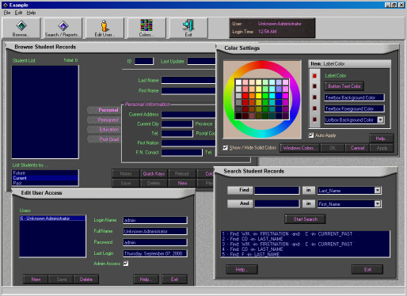



## DBExample

### Description

I got the the layout and design of the program

from CONTACTS 2000 made by Deatree@Yahoo.Com. BUT the

code underneath is radically different!

This program MANAGES AN ACCESS2000 DATABASE with SQL

and query's with Recordsets. The best part about using a

MS JETDB EnGINE4 is that the DB can be accessed through

a network. It also queies a recordset and spits the results

to the NEW DATA REPORT in VB6. I worked hard on this one!

enjoy. READ README.doc for info on running.

e-mail me at mikren@vianet.on.ca for questions.

PS. THANKS MICROSOFT SUPPORT (GENE MOODY)!
 
### More Info
 

             |
---                |---
**Submitted On**   |2000-09-07 00:56:50
**By**             |[Mike Connors](https://github.com/Planet-Source-Code/PSCIndex/blob/master/ByAuthor/mike-connors.md)
**Level**          |Intermediate
**User Rating**    |5.0 (130 globes from 26 users)
**Compatibility**  |VB 6\.0
**Category**       |[Databases/ Data Access/ DAO/ ADO](https://github.com/Planet-Source-Code/PSCIndex/blob/master/ByCategory/databases-data-access-dao-ado__1-6.md)
**World**          |[Visual Basic](https://github.com/Planet-Source-Code/PSCIndex/blob/master/ByWorld/visual-basic.md)
**Archive File**   |[CODE\_UPLOAD9711972000\.zip](https://github.com/Planet-Source-Code/mike-connors-dbexample__1-11327/archive/master.zip)

